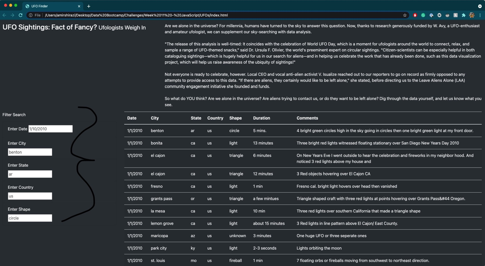
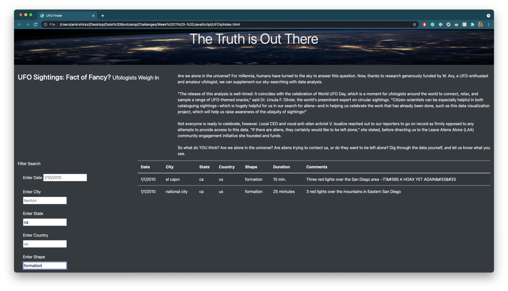
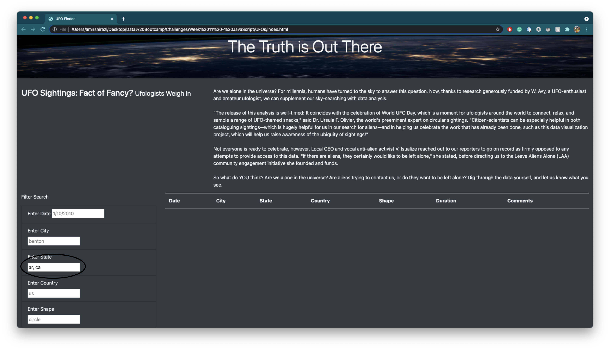

# UFOs

## **Overview**
The purpose of this project is to create a webpage that we designed using Javascript. We wanted to compile, filter, interpret and easily read data from different UFO encounters around the United States and present it on one webpage.

## **Resources**
- **Technology Used**: 
    - Javascript with D3
    - HTML
    - CSS
- **Data**:
    - data.js file

## **Results**
**How to use the Webpage**:

1. Enter the date, city, state, country, or shape associated with the UFO sighting's data. For the filter to work, you must enter at least one input. If desired you may search using all filters. 

2. In the example below, we will be searching for sightings that took place in any city in California that was shaped like a formation. To do this, you will input "ca" in the "Enter State" section and "formation" in the "Enter Shape" section. You may hit "enter" on your keyboard or click anywhere on the page in order to activate the filter. Once activated, the results are given:  PLEASE NOTE: If you are filtering by multiple parameters you must clear all inputs you no longer wish to search by in order for the table to create accurate output. 

## **Summary**
### Drawbacks
One major drawback of our design is the inability to have a search parameter take in multiple inputs. For example, if we wanted to have our table show all UFO sightings that took place in Arkansas AND in California, we would not be able to. The results would be empty despite both states having multiple results.

### Improvement Recommendations
1. One way we could improve upon this table filter is to be able to search by length of time and by keywords included in the comments.
2. Another improvement would be to take in more data -- ideally from more countries. We only have 2 results that come from a country that is not the US (Canada) which makes the country column feel like it is unnecessary and taking up space that could otherwise be given to the comments column for increased readability.